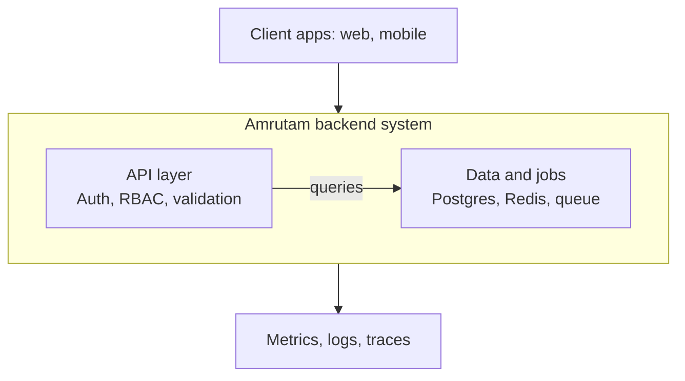
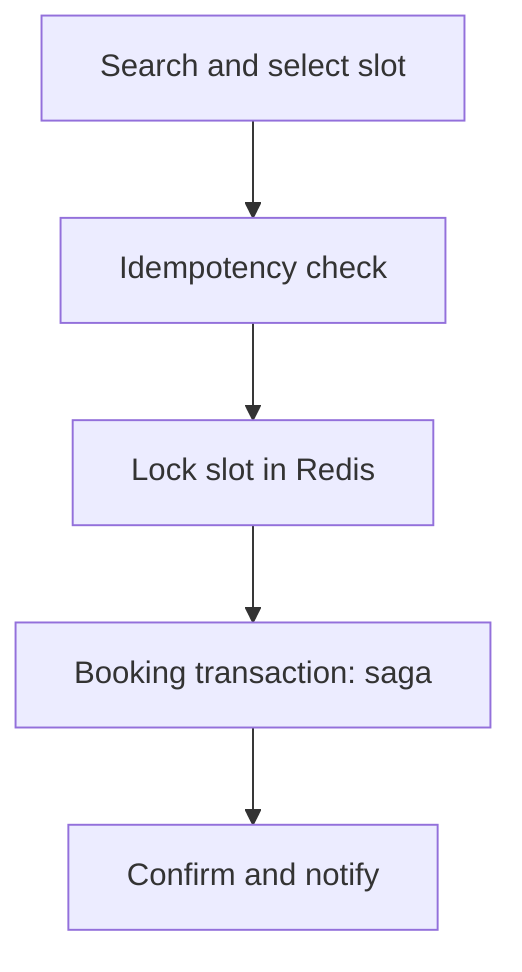

# Amrutam Backend — Architecture Overview

## 1. High-Level Architecture

Client apps (web, mobile) send requests to the Amrutam backend system, built on Node.js + 
Express. The backend has two logical zones: API layer (auth, RBAC, validation, rate limiting) 
and Data & jobs layer (PostgreSQL, Redis, background job queue). Observability data (metrics, 
logs, traces) flows out continuously.



## 2. Booking Flow (Sequence)

When a patient books a consultation slot, the backend executes these steps in order:

1. **Search & select slot** — read-only, patient browses doctors and picks a slot.
2. **Idempotency check** — request carries a unique `Idempotency-Key` header; duplicate requests 
   return the original response instead of creating a duplicate booking.
3. **Lock slot (Redis)** — distributed lock (or Postgres `SELECT ... FOR UPDATE`) ensures only 
   one concurrent request can claim a slot.
4. **Booking transaction (saga)** — booking creation and payment charge succeed or fail together; 
   payment failure rolls back the booking (saga pattern — detailed in Phase 3).
5. **Confirm & notify** — lock released, confirmation dispatched via async job queue.



## 3. Data Flow Summary

Client → API layer (auth/RBAC/validation) → Business logic (modules) → PostgreSQL / Redis → 
Job queue (async side-effects) → Response back to client.

## 4. Retry & Backoff Strategy

Used for async job queue failures (e.g. notification dispatch) and any future external
service calls (e.g. a real payment gateway).

**Strategy**: Exponential backoff with jitter.

| Attempt | Delay |
|---|---|
| 1 | immediate |
| 2 | 1s + random(0-500ms) |
| 3 | 2s + random(0-500ms) |
| 4 | 4s + random(0-500ms) |
| 5 | 8s + random(0-500ms), then move to dead-letter queue for manual review |

Jitter prevents a "thundering herd" when many requests fail simultaneously. Retries are safe
because all mutating endpoints require an `Idempotency-Key`, so a retried request cannot cause
duplicate side effects.

## 5. Caching Strategy

**Target**: `GET /doctors/:doctorId/availability` — a read-heavy, infrequently-changing endpoint.

**Pattern**: Cache-aside (lazy loading).
1. Check Redis key `cache:doctor:<id>:availability`.
2. On hit, return cached data directly.
3. On miss, query PostgreSQL, populate the cache with a 60s TTL, then return.

**Invalidation**: On any slot creation or successful booking for a doctor, the corresponding
cache key is deleted immediately (write-through invalidation), so stale availability is visible
for at most the TTL window in the rare case invalidation is missed. The Redis distributed lock
used during booking is the primary defense against double-booking, not the cache TTL.

## 6. Data Partitioning Strategy

**Target tables**: `consultations` and `audit_logs` — both grow unbounded with usage (at 100k
daily consultations, ~36.5M rows/year).

**Approach**: PostgreSQL native declarative range partitioning by `created_at`, with monthly
partitions:

```sql
CREATE TABLE consultations (...) PARTITION BY RANGE (created_at);
CREATE TABLE consultations_2026_07 PARTITION OF consultations
  FOR VALUES FROM ('2026-07-01') TO ('2026-08-01');
```

This lets time-bounded queries (e.g. admin analytics over "last 30 days") scan only the relevant
partition instead of the full table.

`users`, `doctors`, and `availability_slots` are not partitioned — they stay in the hundreds of
thousands to low millions of rows range, where partitioning overhead would outweigh the benefit.

**Future scale-out**: If a single PostgreSQL instance becomes a bottleneck, read replicas can be
introduced — reads (availability search, analytics) routed to a replica, writes (bookings) to the
primary. Since all DB access already goes through a repository layer, this can be added later
without touching business logic.


