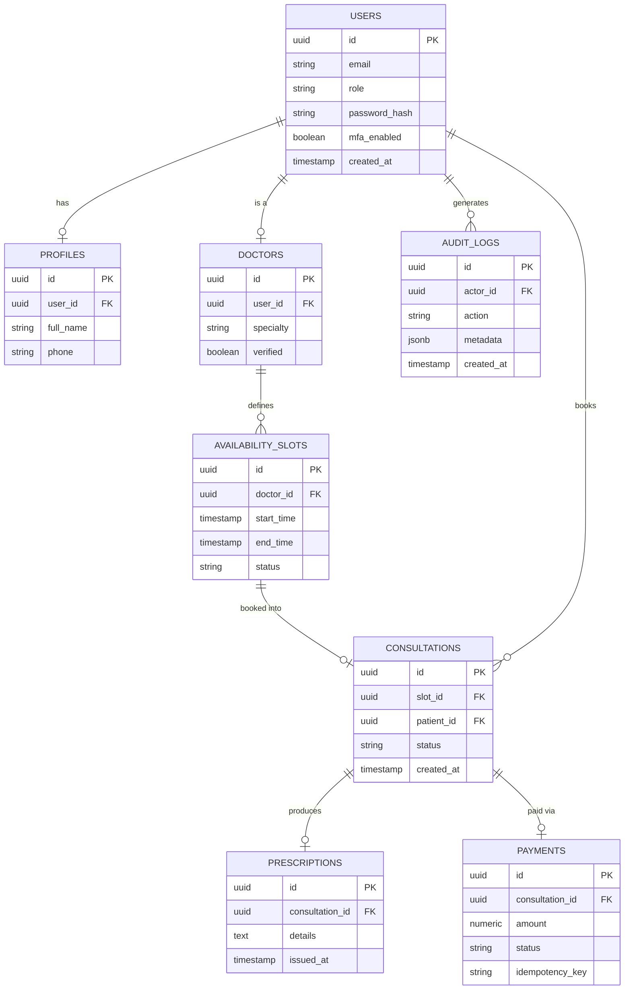

# Amrutam Backend — ER Diagram

```mermaid
erDiagram
    USERS ||--o| PROFILES : has
    USERS ||--o| DOCTORS : "is a"
    DOCTORS ||--o{ AVAILABILITY_SLOTS : defines
    AVAILABILITY_SLOTS ||--o| CONSULTATIONS : "booked into"
    USERS ||--o{ CONSULTATIONS : books
    CONSULTATIONS ||--o| PRESCRIPTIONS : produces
    CONSULTATIONS ||--o| PAYMENTS : "paid via"
    USERS ||--o{ AUDIT_LOGS : generates

    USERS {
        uuid id PK
        string email
        string role
        string password_hash
        boolean mfa_enabled
        timestamp created_at
    }
    PROFILES {
        uuid id PK
        uuid user_id FK
        string full_name
        string phone
    }
    DOCTORS {
        uuid id PK
        uuid user_id FK
        string specialty
        boolean verified
    }
    AVAILABILITY_SLOTS {
        uuid id PK
        uuid doctor_id FK
        timestamp start_time
        timestamp end_time
        string status
    }
    CONSULTATIONS {
        uuid id PK
        uuid slot_id FK
        uuid patient_id FK
        string status
        timestamp created_at
    }
    PRESCRIPTIONS {
        uuid id PK
        uuid consultation_id FK
        text details
        timestamp issued_at
    }
    PAYMENTS {
        uuid id PK
        uuid consultation_id FK
        numeric amount
        string status
        string idempotency_key
    }
    AUDIT_LOGS {
        uuid id PK
        uuid actor_id FK
        string action
        jsonb metadata
        timestamp created_at
    }
```